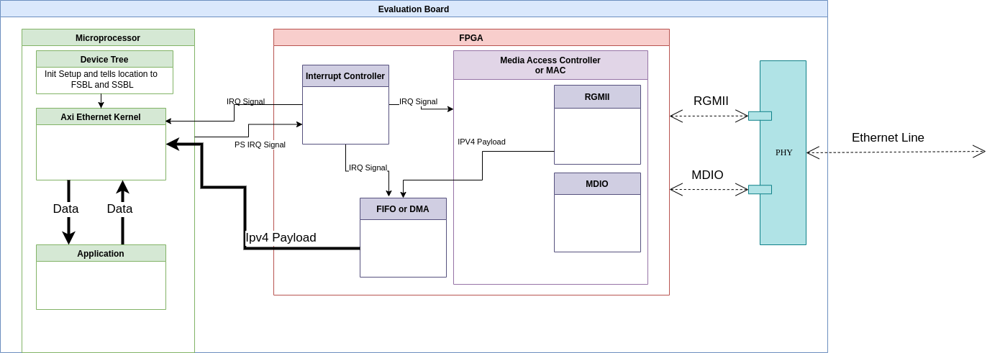

# Hardware for Ethernet 

[Return to main page](Project_report.md)

[Firmware](firmware.md)

[Sources](sources.md)

## Overview

The first piece of hardware that we needed to understand was the PHY chip. 
This is the first place that the data from an ethernet connection goes.
After the data moves through the PHY chip it goes to a MAC or Media Access Controller which is built by the FPGA.
The MAC will determine where the data is going and is made up of several smaller blocks as can be seen in figure 1.
It also contains the protocol the system will use to store and send the data that is moved. 
There are two different methods that we found that can be used and we will describe them both.
We also created some test benches for the Verilog hardware that we used.

We found some great resources that helped us understand the ethernet hardware and used code from several different places. 
The sources we used for some of our code can be found [here](sources.md)

Figure 1:
general structure of hardware

We will also go over more of the AXI protocols and how they work in this section of the report

## PHY Chip
the PHY chip basically acts like a read and write enable. 
It allows the ethernet port to switch between sending and receiving data. 
This is needed to allow the port to communicate both directions.

## MAC 
The MAC controls a few different things. 
It tells The PHY what direction data is going to flow, and it has methods to control where the data is stored and how it is accessed. 
Those methods are kept under the Network Layer Protocol Control and we will cover two of them. 
In figure one we show the MAC being influenced by a state Machine, but that is different to how we ended up changing the MAC.
We used a petalinux [firmware](firmware.md) instead of a state machine solution.

### RGMII
The RGMII or Reduced gigabit media-independent interface is the way the data is seperated from the rest of the ethernet frame and this specific version is able to transmit data on both the rising and falling edges of the clock.
We can see the breakdown of an ethernet frame in figure 2 which shows how the date is segmented.

Figure 2: Ethernet Frame 

### MDIO
The MDIO or Management Data Input/Output is used to coordinate the MAC to the PHY chip.
It sends the PHY instructions as to whether if the port is sending or receiving data.
The PHY follows the instructions that are sent to it.

## Network Layer Protocol Control
The first method that we researched was the FIFO method. 
The second method we found is the DMA.
They both store the data they just use different methods to do so.
They also will also stream the data out using the AXI-Stream port.

### FIFO
A FIFO or First In First Out will store the data in an internal memory or PL that the FIFO contains. 
It is the simpler of the two methods, but is is also slower and needs more of the FPGA to work. 

[Verilog code for FIFO](https://github.com/DenverConger/kria_eth/blob/main/hw/kria_state_machine/kria_state_machine.srcs/sources_1/imports/verilog-ethernet/lib/axis/rtl/axis_async_fifo.v)

### DMA
DMA or Direct Memory Access is able to use the DDR RAM for storage and is faster than the FIFO method.

Verilog code for DMA
~~~

~~~

## Simulation and Test Benches

Test bench code
~~~

~~~

## AXI and other specifics

